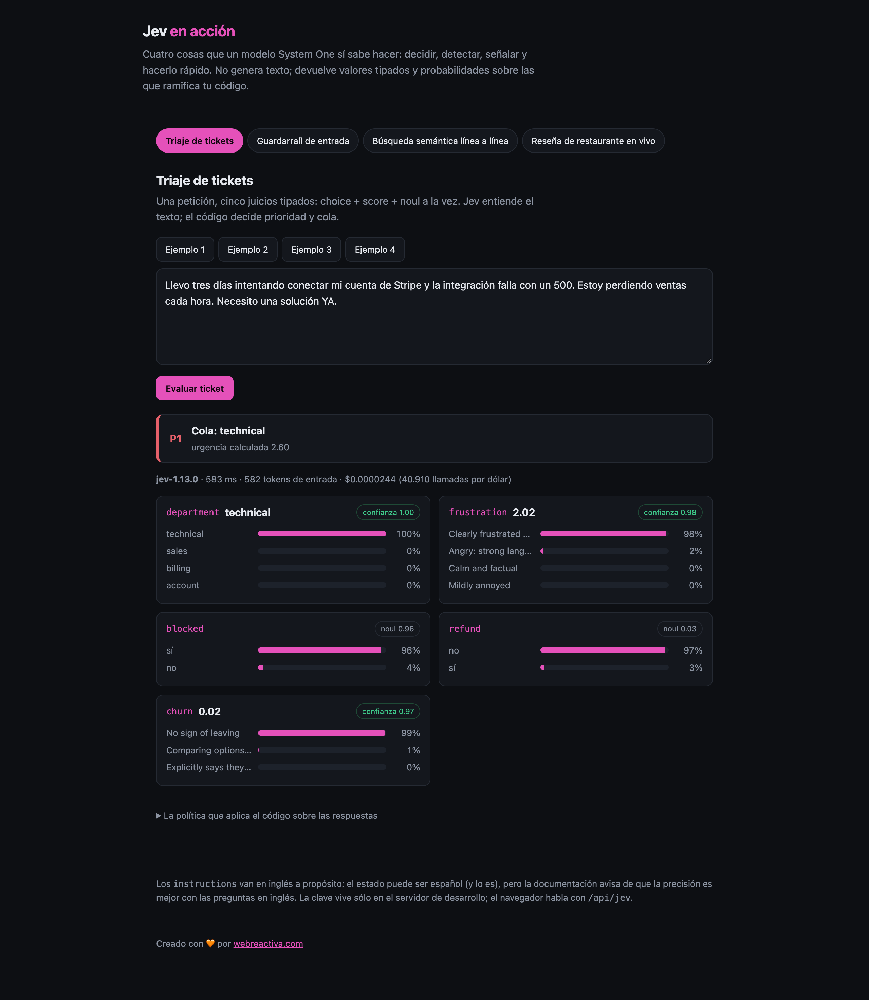
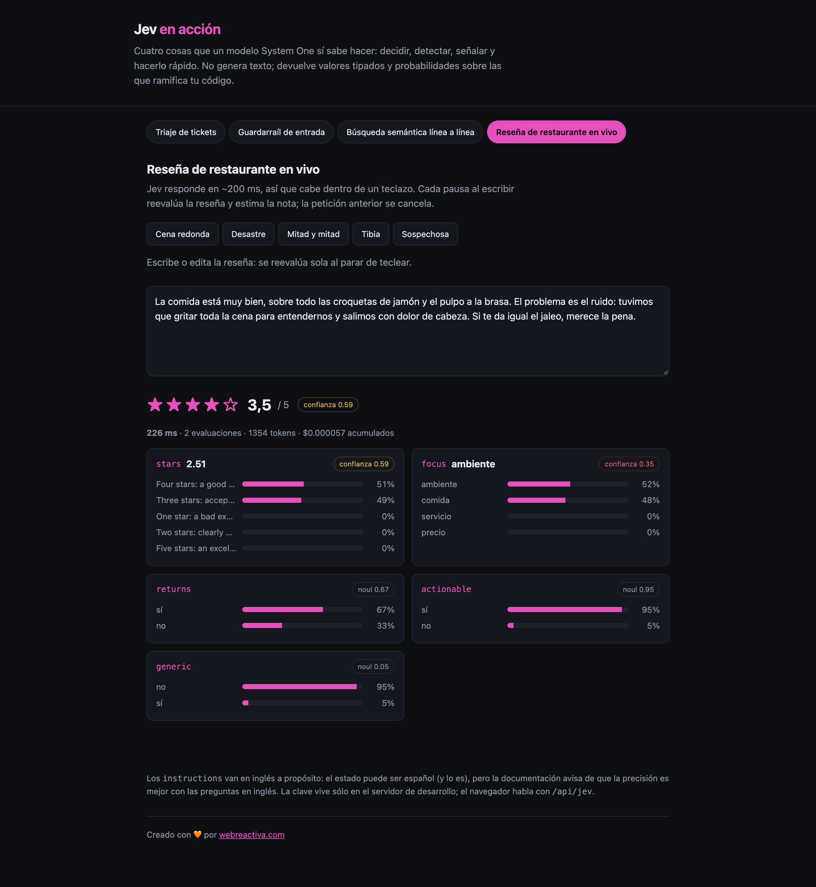
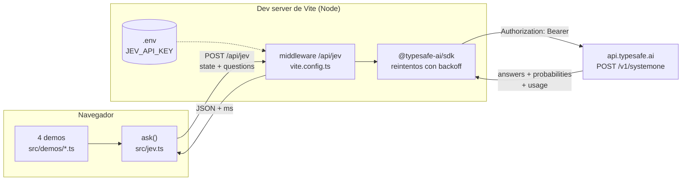
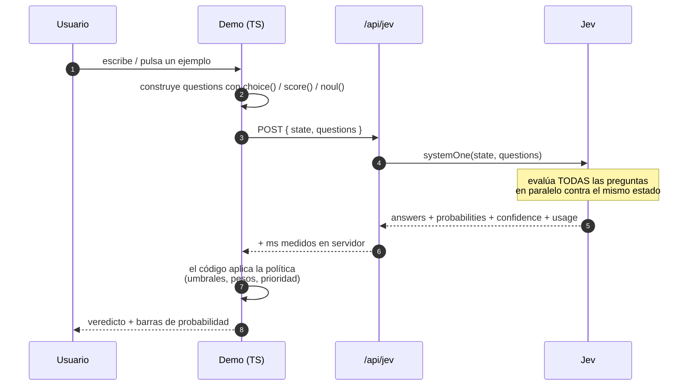
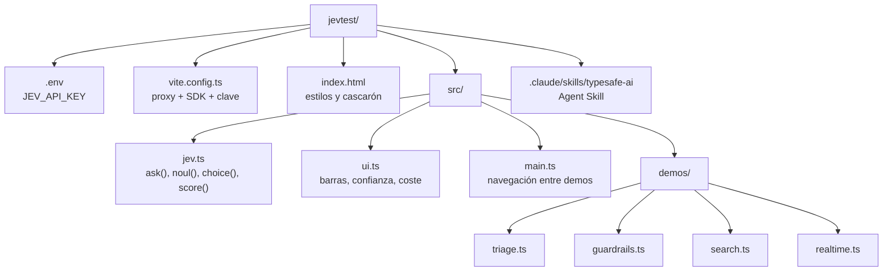

# Jev en acción

Cuatro demos web, en TypeScript, de lo que un **modelo System One** sí sabe hacer.

Jev no genera texto: evalúa *preguntas tipadas* contra un *estado* y devuelve
valores que el código puede usar tal cual —una opción elegida, un número en una
escala, una probabilidad— acompañados de su distribución y su confianza. Estas
demos existen para verlo funcionando de verdad, con latencias y costes reales en
pantalla.


*Triaje: cinco juicios sobre el mismo ticket en 557 ms y una sola petición.*


*Reseña en vivo: la nota se recalcula al parar de teclear. Aquí una reseña
ambivalente se queda en 3,5/5 con confianza 0,59 — la duda del modelo es visible
en la distribución, y el código puede decidir no publicar la nota sin revisar.*

## Por dónde se empieza

**1. Genera una API key** en [console.typesafe.ai/keys](https://console.typesafe.ai/keys).
**Es gratis**: creas la cuenta, generas la clave y ya puedes llamar a la API.

**2. Ponla en un `.env`** en la raíz del proyecto:

```bash
cp .env.example .env
# edita .env y pega la clave que te acaba de dar la consola:
#   JEV_API_KEY=apik...
```

**3. Arranca:**

```bash
npm install
npm run dev   # http://localhost:5180
```

Y ya está. Si falta la clave, el servidor se niega a arrancar y lo dice, en vez de
dejarte descubrirlo demo por demo.

> `.env` está en el `.gitignore` y la clave **no baja nunca al navegador**: se queda
> en el proceso de Node, que es quien llama a la API. Ver [Arquitectura](#arquitectura).

---

## Las cuatro demos

| Demo | Primitivas | Qué demuestra |
| --- | --- | --- |
| **Triaje de tickets** | `choice` + `score` ×2 + `noul` ×2 | Cinco juicios en **una sola petición**. La prioridad y la cola las calcula el código a partir de las respuestas |
| **Guardarraíl de entrada** | `noul` ×5 | Filtro barato antes de gastar en un LLM: inyección de prompt, datos personales, fuga de secretos, abuso, off-topic |
| **Búsqueda semántica línea a línea** | `choice` (30 opciones) + `noul` | Señala *qué línea* de un documento responde a la pregunta, y detecta cuándo la respuesta **no está** |
| **Reseña de restaurante en vivo** | `score` + `choice` + `noul` ×3 | Nota estimada sobre 5 mientras escribes, en ~200 ms, con detección de reseña genérica |

Medidas reales de una sesión: 244–606 ms por petición, entre 400 y 1500 tokens
de entrada, alrededor de **$0,00002 por llamada** (unas 40 000 llamadas por dólar).

---

## Arquitectura



La clave vive **sólo** en el proceso de Node. El navegador habla con
`/api/jev`, que es un middleware del dev server: 40 líneas en `vite.config.ts`
que reenvían el cuerpo al SDK oficial y devuelven la respuesta con la latencia
medida en el servidor.

## Qué pasa en una petición



El punto entero está en el paso 8: **Jev juzga, el código decide**. Cambiar la
prioridad de un ticket es cambiar un coeficiente en una función, no reescribir
un prompt.

## Estructura del repositorio



Siete ficheros de código. No hay framework, ni router, ni gestor de estado: el
DOM se pinta con plantillas de texto porque una demo no necesita más.

---

## Cómo se ha construido

1. **Leer la documentación antes que nada.** Conceptos, primitivas, cookbooks,
   referencia de la API y los dos SDK. De ahí salen las decisiones de diseño, y
   no de la intuición. El índice pensado para agentes está en
   [`llms.txt`](https://docs.typesafe.ai/llms.txt), y cualquier página devuelve
   Markdown si le añades `.md` a la ruta.
2. **Comprobar que la clave funciona** con un `curl` a `/v1/models` antes de
   escribir una línea de aplicación.
3. **Elegir el andamiaje mínimo**: Vite (TypeScript en el navegador sin
   configuración) más `@typesafe-ai/sdk` en el servidor. Node 24, `tsc --noEmit`
   como comprobación.
4. **Un middleware, no un backend.** El proxy son unas pocas líneas dentro de
   `vite.config.ts`. En producción ese mismo middleware se muda a una función
   serverless; el frontend no cambia.
5. **Diseñar las preguntas leyendo los cookbooks.** La búsqueda línea a línea es
   una adaptación directa de
   [Line-by-line search](https://docs.typesafe.ai/cookbooks/semantic_find); el
   guardarraíl viene de
   [Guardrails for LLMs](https://docs.typesafe.ai/cookbooks/llm_guardrails).
6. **Verificar cada demo contra la API real**, incluidos los casos negativos:
   la pregunta cuya respuesta no está en el documento, la reseña genérica, el
   mensaje con inyección de prompt.

### Decisiones que no son accidentales

- **`instructions` en inglés, `state` en español.** La
  [documentación de modelos](https://docs.typesafe.ai/models) avisa de que el
  inglés es donde la precisión es mejor. El contenido del usuario se manda tal
  cual.
- **La aritmética, siempre en código.** Jev no cuenta, no compara fechas y no
  es una calculadora ([Jev 1.13 jaggedness](https://docs.typesafe.ai/model-jaggedness/jev-1.13)).
  Las sumas
  ponderadas, los umbrales y el orden los hace TypeScript.
- **Dos juicios en la búsqueda.** Las probabilidades de un `choice` suman 1, así
  que *alguna* línea gana aunque ninguna valga. El `noul`, que es absoluto, es
  quien dice si hay respuesta. Es el único motivo por el que la demo acierta al
  responder «no está».
- **Un `noul` por riesgo en el guardarraíl, no un `choice`.** Los riesgos no
  compiten entre sí: pueden darse todos a la vez, o ninguno.
- **Umbrales explícitos.** «Cualquier infracción grave» es un `some()`, no una
  media ponderada. La política se lee en el código y se cambia sin tocar el
  modelo.

---

## Qué son las skills y qué hacen aquí

Una **Agent Skill** es una carpeta con un `SKILL.md` que un agente de código
carga cuando la tarea encaja con su descripción. No es código que se ejecute:
son instrucciones y referencias que cambian cómo trabaja el agente.

### `typesafe-ai` — instalada en el proyecto

```bash
npx skills add typesafe-ai/skills --skill typesafe-ai
# queda en .claude/skills/typesafe-ai/
```

Es la skill oficial de TypeSafe ([repositorio](https://github.com/typesafe-ai/skills)).
Lo que aporta:

- **Manda leer la documentación viva** en lugar de tirar de memoria, y da el
  índice de páginas relevantes según la tarea (`https://docs.typesafe.ai/llms.txt`,
  con Markdown añadiendo `.md` a cualquier ruta).
- **Enseña a elegir primitiva**: `choice` cuando una opción debe ganar, `noul`
  cuando varias etiquetas pueden darse a la vez, `score` cuando hay un grado
  sobre una escala ordenada.
- **Recuerda la división del trabajo**: reglas, cálculos y ejecución en código;
  el modelo sólo donde hace falta comprensión semántica.
- **Insiste en preguntas atómicas** y en mandar en el mismo `state` sólo lo que
  la pregunta necesita.
- Y una línea que se aplicó literalmente aquí: *keep API credentials
  server-side in web apps*.

También existe como plugin de Claude Code:

```bash
claude plugin marketplace add typesafe-ai/skills
claude plugin install typesafe@typesafe-ai
```

### `mermaid-diagrams` — usada al escribir este README

Skill de diagramado: guía para elegir tipo de diagrama y escribir la sintaxis
correcta. Los tres diagramas de arriba salen de ahí, y se renderizan solos en
GitHub sin generar ninguna imagen.

---

## Documentación

- [Documentación de TypeSafe](https://docs.typesafe.ai/) · [índice para agentes](https://docs.typesafe.ai/llms.txt)
- [Introducción](https://docs.typesafe.ai/introduction) y [Quick start](https://docs.typesafe.ai/introduction/quickstart)
- Primitivas: [Choice](https://docs.typesafe.ai/primitives/choice) · [Score](https://docs.typesafe.ai/primitives/score) · [Noul](https://docs.typesafe.ai/primitives/noul)
- [Confianza](https://docs.typesafe.ai/confidence) — qué significa y cómo enrutar con ella
- [Cómo construir con TypeSafe](https://docs.typesafe.ai/concepts/how-to-build-with-system-one) y [patrones](https://docs.typesafe.ai/patterns)
- [Referencia de la API HTTP](https://docs.typesafe.ai/api) · [SDK de JavaScript](https://docs.typesafe.ai/sdk/javascript)
- [Modelos, precios y límites](https://docs.typesafe.ai/models) · [lo que Jev todavía hace mal](https://docs.typesafe.ai/model-jaggedness/jev-1.13)
- Cookbooks usados aquí: [Line-by-line search](https://docs.typesafe.ai/cookbooks/semantic_find) · [Guardrails for LLMs](https://docs.typesafe.ai/cookbooks/llm_guardrails)
- [Skill oficial](https://github.com/typesafe-ai/skills) · [Playground](https://console.typesafe.ai/playground)

---

## Producción

El proxy sólo existe en el dev server de Vite. Para desplegar, el mismo
middleware va en una función serverless o en el backend que ya tengas; el
frontend no cambia una línea. Lo que no se negocia: la clave nunca baja al
navegador.

---

Creado con 🧡 por [webreactiva.com](https://webreactiva.com)
